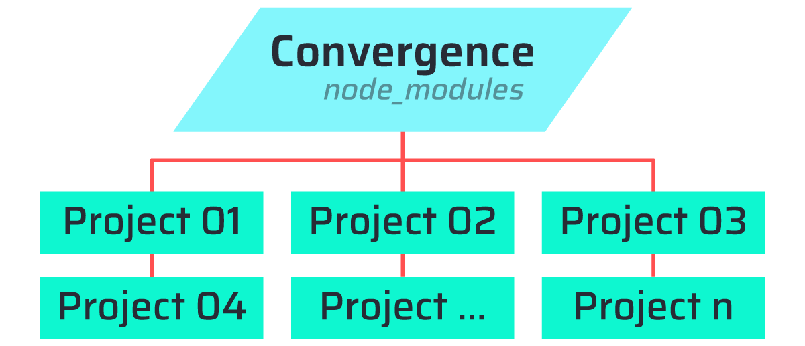
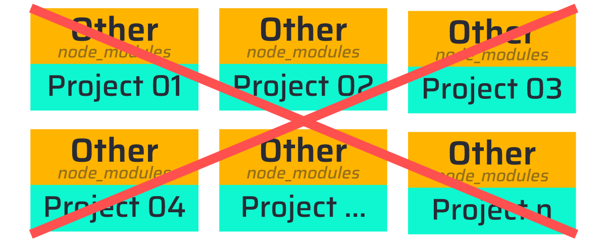
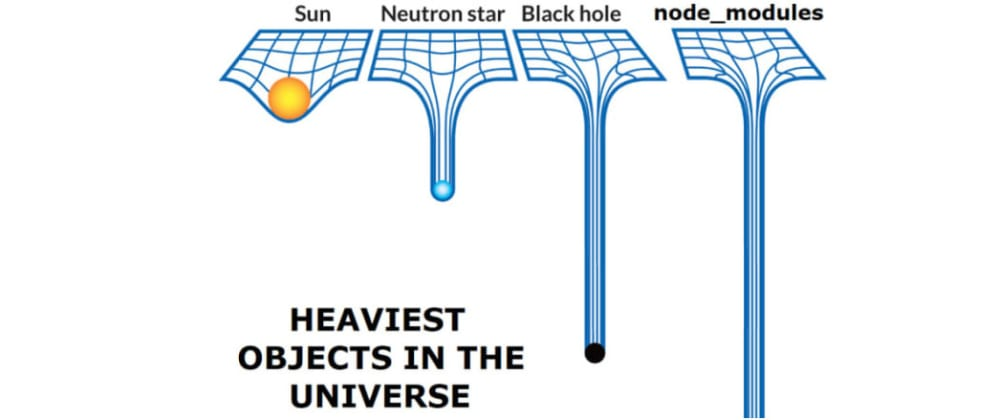

# **Convergence ζ**

- 📦 *Toolkit:* **`Convergence ζ`**
- 🏗️ *Version:* **`1.2.0`**
- 👨‍💻 *Author:* [**VQH-cmd**](https://VQH-cmd.github.io)

<br>

________________________________________________________________

<br>

## **`[01]:` Description**

- **[Convergence Zeta](#)**
- A toolkit for **[Monolith](https://github.com/VQH-cmd/Monolith)** template.
- Recommend using **[React](https://reactjs.org)** !
- **[Hot Module Replacement](https://webpack.js.org/concepts/hot-module-replacement)** (HMR).
- **[Code-Splitting](https://reactjs.org/docs/code-splitting.html)**.
- Inspired by: **[Captain Panic! & Systek - [Monolith]: Convergence)](https://captainpanicmonolith.bandcamp.com/track/convergence)**.
- **Everything is Connected:** One Package connect to many projects !

<br><br>



<br><hr><br>




<br>

________________________________________________________________

<br>

## **`[02]:` Installation**

💼 *Base*	| 🔗 *Link*
--------	| --------
**Node.js**	| https://nodejs.org (17.x.x)
**webpack**	| https://webpack.js.org

<br>

### **Location**
Put the **[Convergence](#)** anywhere in your device.
Ex: `D:/toolkit/Convergence`
<br>

### **Install Commands** (Terminal):

> [Recommended:](https://yarnpkg.com/) !
> ```
> yarn install
> ```
```
npm install
```

<br>

Then `cd` command it every time using.
Ex:
```
cd D:/toolkit/Convergence
```

<br>

________________________________________________________________

<br>

## **`[03]:` Support**

[SASS/SCSS](https://sass-lang.com)<br>
[JavaScript](https://www.w3schools.com/js) (Not Recommended) `[ .js ]`<br>
[TypeScript](https://www.typescriptlang.org) (Recommended) `[ .ts ]`<br>
[React](https://reactjs.org) `[ .jsx .tsx ]`<br>
[PHP](https://www.php.net) (proxy)<br>
[WordPress](https://wordpress.org) (proxy)<br>
[TheBASE](https://thebase.in) (local + FTP)<br>
`Node Server` ([Express](https://expressjs.com/))<br>
`localhost`<br>
`FTP`


<br>

________________________________________________________________

<br>

## **`[04]:` Usage**

<br>

> Use the **`Terminal`** to execute the command.

<br>

```
yarn s
```
or
```
npm s
```


<br>

________________________________________________________________

<br>

## **`[05]:` Repository tree**

> All files in **`/build`** folder shall be converted into **`/assets`** folder.

<br>

### **`📦` [Pack]: Assets & Build**

+ **`.../`**
	- **`/assets`** *(assets)*
	- **`/build`** *(build)*
		- `/config` *(Config Folder)*
			- `breakpoint.json` (CSS Breakpoint Responsive)
			- `config.json` ([Convergence](#)'s Config)
			- `misc.json` (SASS Config)
			- `ftp.json` (FTP Config)
			- `theme.json` (Themes/Colors Config)
			- `whitelist.json` (PurgeCSS config)
		- `/js` *(JavaScript + TypeScript)*
			- `script.ts`
		- `/sass` *(SASS)*
			- `style.sass`
		- `/pug` (Pug)
	- **`/docs`** *(identify)*

<br>

----------------------------------------------------------------

<br>

### **`default`: Front-End, [React](https://reactjs.org), [PHP](https://www.php.net), [WordPress](https://wordpress.org)**

+ **`Project_Name/`** *(also the root)*
	- **`📦[Pack]`**
	- `/data` *(database)*
	- `/docs` *(information about the Project)*
	- `/inc` *(include PHP files)*
	- `/locale` *(internationalization)*
	- `.htaccess`
	- `robots.txt`
	- `...`

<br>

----------------------------------------------------------------

<br>

### **[TheBASE](https://thebase.in)**

+ **`Project_Name/`** *(also the root)*
	- **`📦[Pack]`**
	- `index.html` *(result)*
	- `*.css` *(result)*
	- `*.js` *(result)*

<br>

________________________________________________________________

<br>

## **`[06]:` Issue**

- For **`CORS`** issue if using `proxy`, just install **[CORS Unblock](https://chrome.google.com/webstore/detail/cors-unblock/lfhmikememgdcahcdlaciloancbhjino)**.

<br>

________________________________________________________________

<br>

## **`[07]:` Download**

Download link in any **Monolith** project via this location:
+ **`Project_Name/`** *(also the root)*
	- **`/build`**
		- `convergence.yml`

<br>

________________________________________________________________

Copyright © 2022, [VQH-cmd](https://VQH-cmd.github.io).

<br><br>

